# lab-mqtt

Github: <https://github.com/wu-wenxiang/lab-mqtt>

Gitee 同步：<https://gitee.com/wu-wen-xiang/lab-mqtt>

## 1. 基本环境 Quick Start

### 1.1 基础环境

#### 1.1.1 云服务器：

- CentOS 7.9
- 2C/4G/40G
- 50M 带宽

#### 1.1.2 预配置

```console
$ pwd
/Users/wuwenxiang/local/github-mine/demotheworld/ansible

$ cat playbooks/cloudlab-init-with-rdp.yaml
- hosts: cloudlabs
  roles:
    # - init00-mount-disk
    - init01-prepare
    # - init02-rdp
    # - init03-01-kvm
  become: yes

$ diff inventory/lab-c2009.ini inventory/c2009.ini.example 
24c24,25
< lab-mqtt
---
> cloudlab001
> cloudlab002

$ ansible-playbook -i inventory/lab-c2009.ini playbooks/cloudlab-init-with-rdp.yaml
```

#### 1.1.3 安装 Docker 环境

参考：<https://gitee.com/dev-99cloud/training-kubernetes/blob/master/doc/class-01-Kubernetes-Administration.md#16-%E5%AE%9E%E9%AA%8Cdocker-quick-start>

```bash
apt-get update -y || yum update -y
apt-get install docker.io -y || yum install docker -y
systemctl enable docker --now
docker run hello-world
```

### 1.2 MQTT Server 搭建

#### 1.2.1 使用 emqx 搭建

```bash
# 搭建 MQTT Server（可选）
docker stop emqx
docker rm emqx
docker run -d --name emqx -p 1883:1883 -p 8081:8081 -p 8083:8083 -p 8084:8084 -p 8883:8883 -p 18083:18083 emqx/emqx:4.3.11
```

### 1.3 配置 MQTT 客户端

#### 1.3.1 MAC 上的 MQTTX


#### 1.3.2 Python Client

```bash
pip3 install paho-mqtt

python src/mqtt_subscribe.py 101.132.183.71 1883 "V2X.RSU.RSM.UP2"
python src/mqtt_publish.py 101.132.183.71 1883 "V2X.RSU.RSM.UP2"
```

### 1.4 MQTT 配置项

MQTT Spec：<https://mqtt.org/mqtt-specification/>

#### 1.4.1 QoS

按照 MQTT QoS 描述，QoS 2 表示 [Exactly once delivery](http://docs.oasis-open.org/mqtt/mqtt/v3.1.1/os/mqtt-v3.1.1-os.html#_Toc398718037)，QoS 2 需要服务端和客户端双方配合，参考 <https://www.emqx.com/en/blog/introduction-to-mqtt-qos>


| QoS of publish | QoS of subscribe | QoS of received message |
| - | - | - |
| 0 | 0 | 0 |
| 0 | 1 | 0 |
| 0 | 2 | 0 |
| 1 | 0 | 0 |
| 1 | 1 | 1 |
| 1 | 2 | 1 |
| 2 | 0 | 0 |
| 2 | 1 | 1 |
| 2 | 2 | 2 |

测试场景：Wireshark 抓包（如果端口不是 1883，那么直接写 mqtt 过滤不出来，需要设置一下）

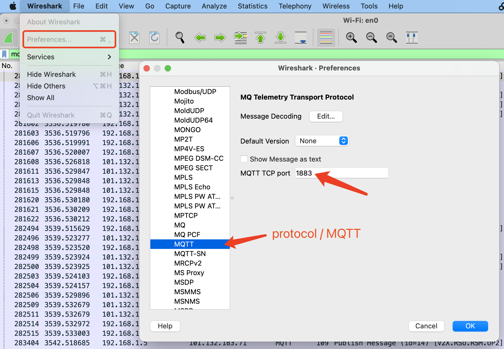

一个 Publisher，三个 Subscriber


QoS 2 场景，Broker 只有在收到 PUBREC 才不再发 PUBLISH 消息，因此多 Subscribers 场景下，消息会发送多次（Message ID 不同）。

这里要考虑使用 MQTT 5.0 中的共享订阅，才能通过负载均衡来避免重复消息（也不能保证绝对）。

#### 1.4.2 Retain

Retain 的使用场景，参考 <https://www.emqx.com/en/blog/mqtt5-features-retain-message>


当 retain = True 时，发消息之后再 subscribe 对应 topic 的 client 也能收到，一般用于设备状态汇报。

#### 1.4.3 Clean Session

Clean Session 参考：<http://www.steves-internet-guide.com/mqtt-clean-sessions-example/>

Clean Session = False 时，除非 Client 主动 unsubsribe，否则 Topic 一直存在，离线消息会被保存，直至 client 重新上线接收，不论 QoS 0/1/2 均如此。

#### 1.4.4 结论

生产环境中，为了保证不丢包 & 兼顾性能

1. MQTT Version == 3.11 或 5？
2. CleanSession = True
3. Retain = False
4. QoS = 1

## 2. 压测

### 2.1 Jemeter

#### 2.1.1 Jmeter 测试 MQTT 服务

##### 2.1.1.1 前提条件

1. 已部署可在公网访问的 MQTT 服务
2. 已安装 JMeter 5.x 版本

##### 2.1.1.2 安装 MQTT Plugin

1. 下载 mqtt-jmeter 插件最新版本 JAR 包
2. 拷贝插件 JAR 包到 JMeter 安装目录的 lib/ext/ 子目录下

##### 2.1.1.3 本地编辑 Jmeter 脚本

打开 JMeter，新建脚本。右键单击 `Test Plan` ，选择 `Add > Threads (Users) > Thread Group`。右键单击 `Test Plan`，选择 `Add > Listener > View Results Tree`，添加 `View Results Tree` 监听器，方便本地调试测试脚本。

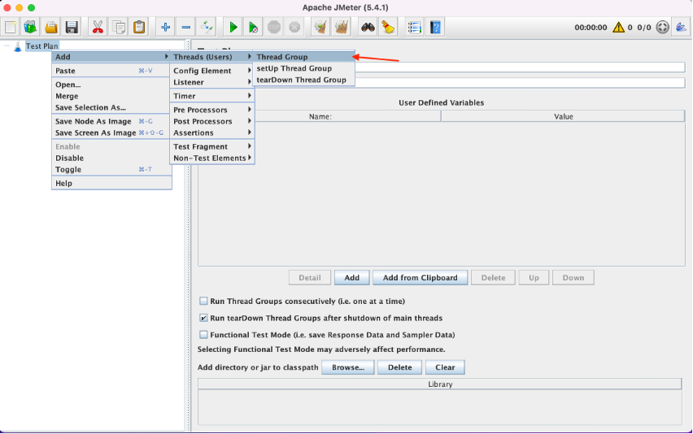

##### 2.1.1.4 建立 MQTT 连接

建立 Subscribe 连接

首先建立与 MQTT 服务器之间的连接，并添加 MQTT Sub Sampler 订阅 MQTT 服务器。

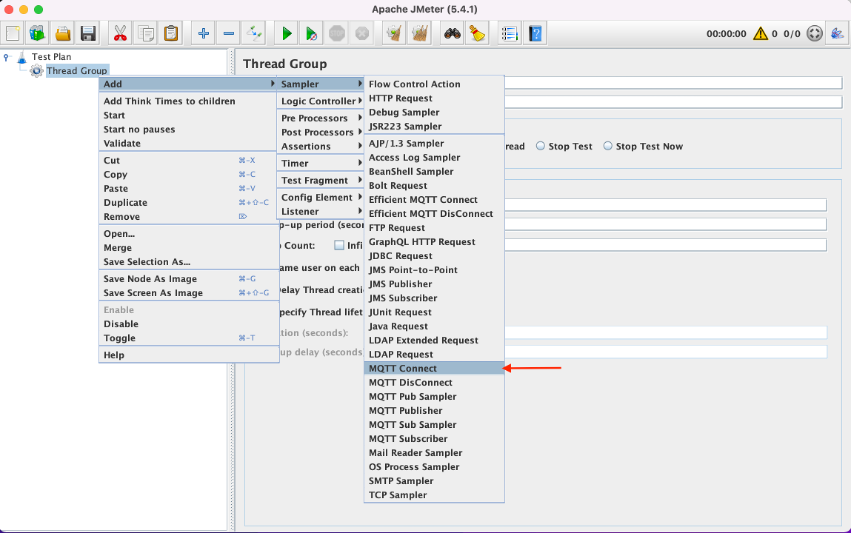

右键单击 `Thread Group`，选择 `Add > Sampler > MQTT Connect`，配置如下：

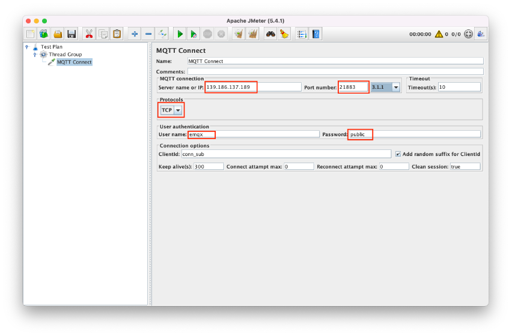

MQTT 连接配置：

- Server name or IP 填写 腾讯MQTT 服务器公网地址。客户端设备通常使用公网访问 MQTT 服务。
- Port number MQTT 服务器端口。填写 21883。
- MQTT version 选择 MQTT 版本。选择 3.1.1，目前主流 MQTT 服务器都支持 3.1.1 版本。
- Timeout(s) 超时秒数填写，即客户端建立连接、发送消息等相关操作的超时时间。填写 10，可按需调整。
- Protocols 连接协议。选择 TCP，即使用标准 TCP 连接协议。
MQTT 客户端配置：
- User name 填写 emqx。
- Password 填写 public 。
- ClientId 填写 ${clientId}。（随意）
- 取消勾选 Add random suffix for ClientId 。本例使用预先准备好的固定客户端 ID，不要添加后缀。
- Keep alive(s) 活动心跳间隔秒数。填写 300，连接空闲时，每 5 分钟发送一次活动心跳，可按需调整。

##### 2.1.1.5 订阅消息

右键单击 `Thread Group`，选择 `Add > Sampler > MQTT Sub Sampler`，配置如下：

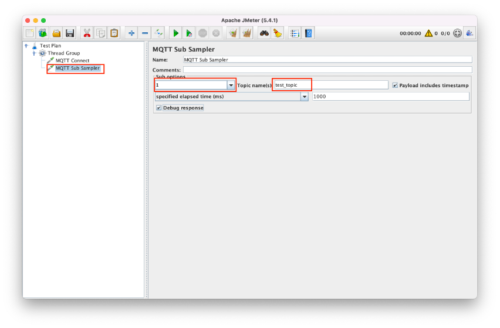

- QoS Level 服务器向客户端推送消息的服务质量。选择 1 ，即至少发送一次，可按需选择其他级别。
- Topic name 填写消息 topic 。应与发布消息的 topic 匹配。
- 勾选 Payload includes timestamp，与发送消息时添加时间戳对应，接收消息后从消息头解析出发送时间，从而计算出消息延迟，即从发布端、途经服务器、最后到达订阅端花费的总时间。
- Sample on 选择 specified elapsed time (ms)，值填写 1000，表示持续接收消息 1000 毫秒。
这段时间内，可能一条消息都接收不到，也可能接收到多条消息。
- 勾选 Debug response，记录接收到的消息内容，方便调试排查问题。正式执行性能测试时可取消该选项以优化性能和减少内存占用。

##### 2.1.1.6 建立 Publish 连接

建立与 MQTTOXY 服务之间的连接，并添加 MQTT Pub Sampler

MQTT 连接配置：

- Server name or IP 填写部署 MQTTOXY 服务的服务器公网地址。客户端设备通常使用公网访问 MQTT 服务。
- Port number MQTT 服务器端口。填写 5883。
- MQTT version 选择 MQTT 版本。选择 3.1.1，目前主流 MQTT 服务器都支持 3.1.1 版本。
- Timeout(s) 超时秒数填写，即客户端建立连接、发送消息等相关操作的超时时间。填写 10，可按需调整。
- Protocols 连接协议。选择 TCP，即使用标准 TCP 连接协议。
MQTT 客户端配置：
- User name 填写 emqx。
- Password 填写 public 。
- ClientId 填写 `${clientId}`。（随意）
- 取消勾选 Add random suffix for ClientId 。本例使用预先准备好的固定客户端 ID，不要添加后缀。
- Keep alive(s) 活动心跳间隔秒数。填写 300，连接空闲时，每 5 分钟发送一次活动心跳，可按需调整。

##### 2.1.1.7 发布消息

右键单击 Thread Group，选择 `Add > Sampler > MQTT Pub Sampler`，配置如下：

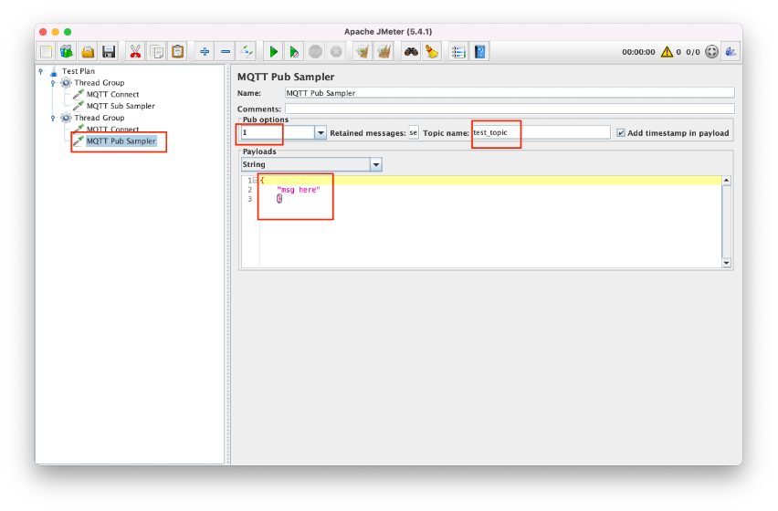

- QoS Level 客户端向服务器发布消息的服务质量。选择 1 ，即至少发送一次，可按需选择其他级别。
- Topic name 填写消息 topic 。MQTT topic 支持层次结构，使用 / 分割，类似文件路径，如 test_topic/test 等，这里简单使用 test_topic 做测试。
- 勾选 Add timestamp in payload ，消息头添加发送时间戳，方便测试时检查消息延迟。

#### 2.1.2 Jmeter 压测 MQ

创建测试脚本并添加线程组：创建两个脚本，一个用作消息发布，一个用作消息接受

1. 打开 JMeter，新建脚本。右键单击 Test Plan ，选择 `Add > Threads (Users) > Thread Group`

    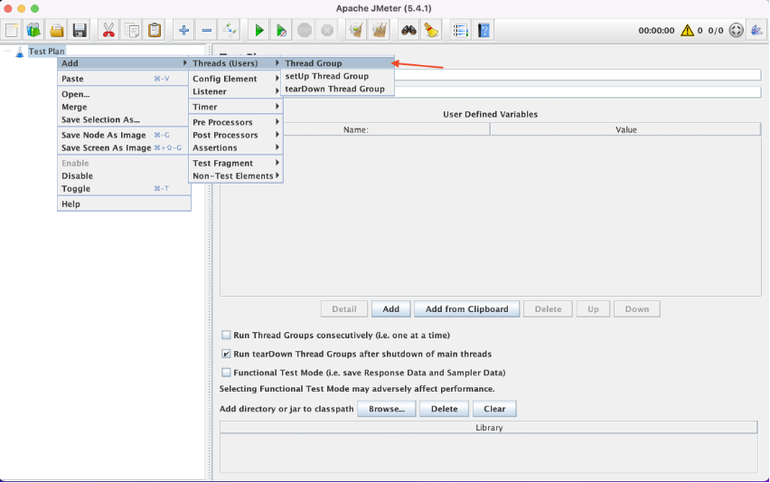

2. 将两个脚本中的 Thread Group 分别重命名为 Publish Group 和 Subscribe Group

    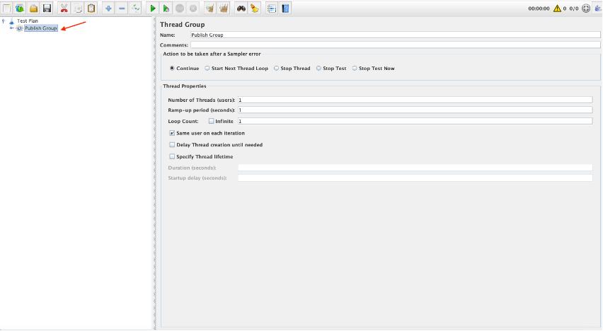

    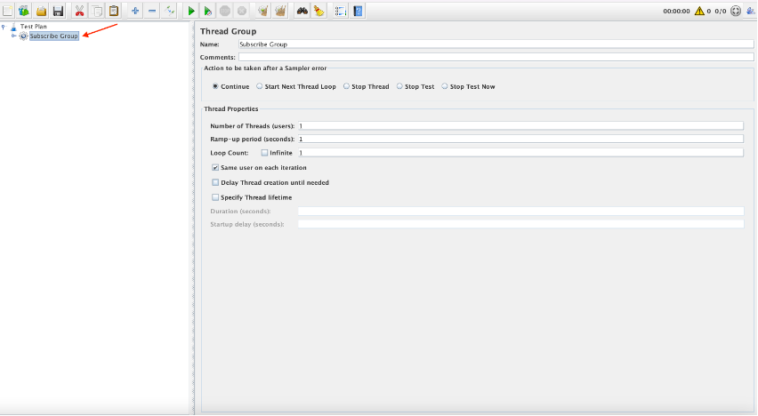

添加请求

1. 添加创建连接请求-分别选中 Publish Group 和 Subscribe Group，点击右键，`Add  > Sampler > MQTT Connect`

    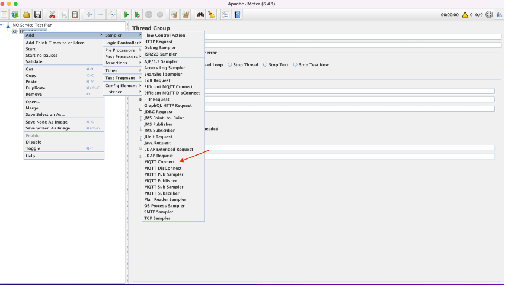

2. 这个请求的作用是进行 MQTT 连接，ip 为 106.15.193.98，端口 1883，用户名 root， 密码 xxxx

    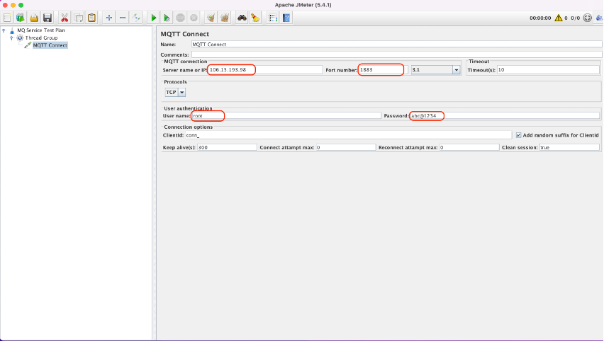

3. 由于连接操作每个线程中只有一次，因此 Publish Group 和 Subscribe Group 分别需要添加 Once Only Contoller ，然后将 MQTT Connect 拖入其下

    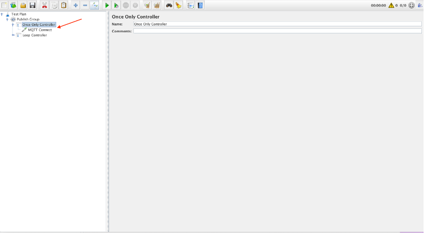

    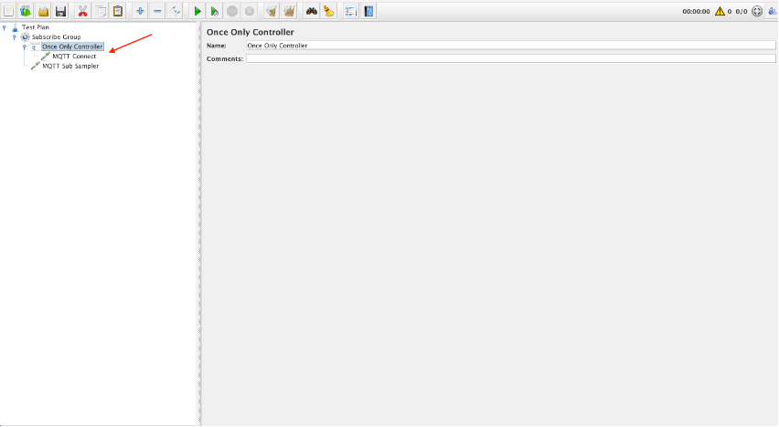

4. 添加循环控制器 Loop Controller 选中 Publish Group 线程组，点击右键，`Add  > Logic Controller > Loop Controller`

    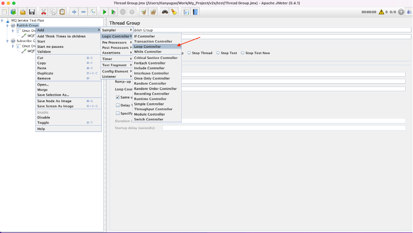

5. 该循环控制器的作用是设置循环发送消息的次数，这里设置为 2000

    

6. 添加发布请求-选中 Loop Controller，点击右键，`Add  > Sampler > MQTT Pub Sampler`

    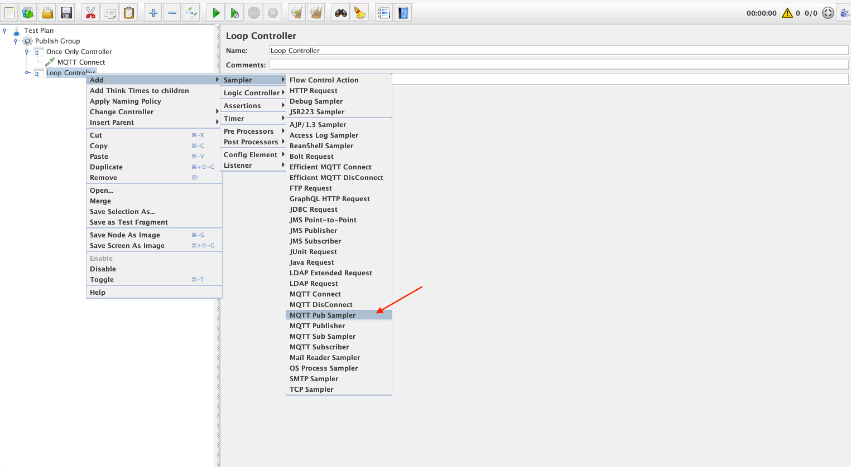

7. 该 MQTT 请求作用是发布消息到服务器，只需要输入主题、发送消息类型、发送消息内容即可

    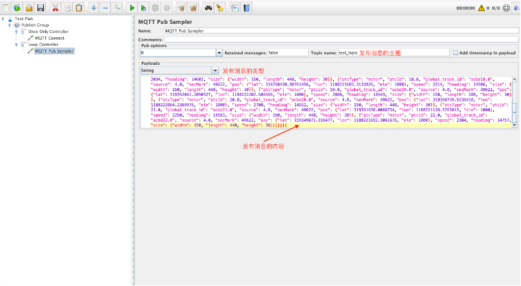

8. 添加断开连接请求-选中 Publish Group 线程组，点击右键，`Add  > Sampler > MQTT Disconnect`

    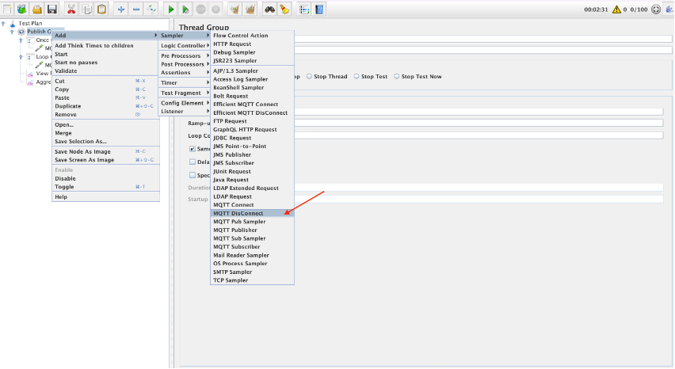

9. 由于 Subscribe Group 需要保持监听，因此不设断开连接，需要将循环次数设为 Infinite

    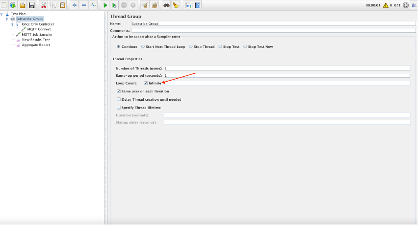

10. 添加订阅请求-选中 Subscribe Group 线程组，点击右键，`Add > Sampler > MQTT Sub Sampler`

    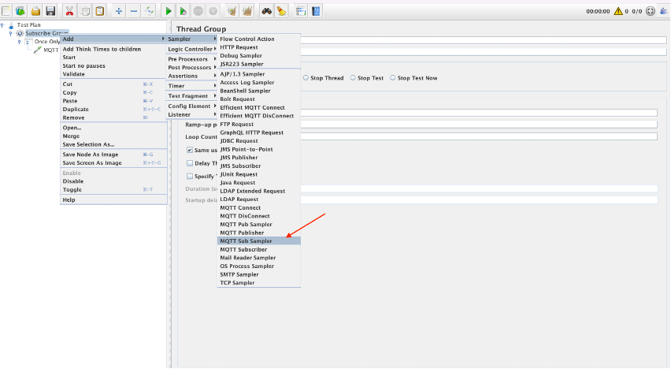

11. 该请求作用是用来订阅发布的消息，只需要输入主题名称，即可订阅

    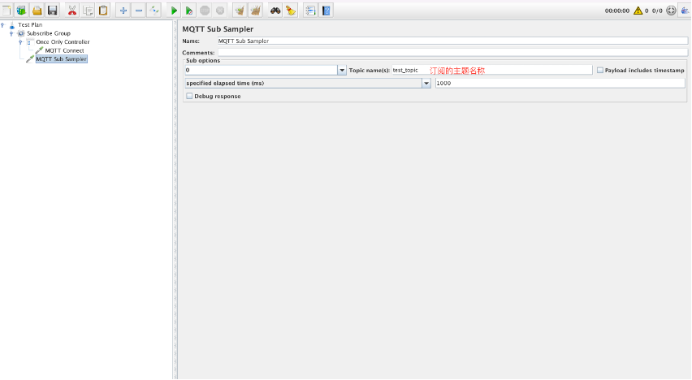

12. 分别为 Publish Group 和 Subscribe Group 添加观察结果树和聚合报告监听器，`Add  > Listener > View Results Tree / Aggregate Report`

    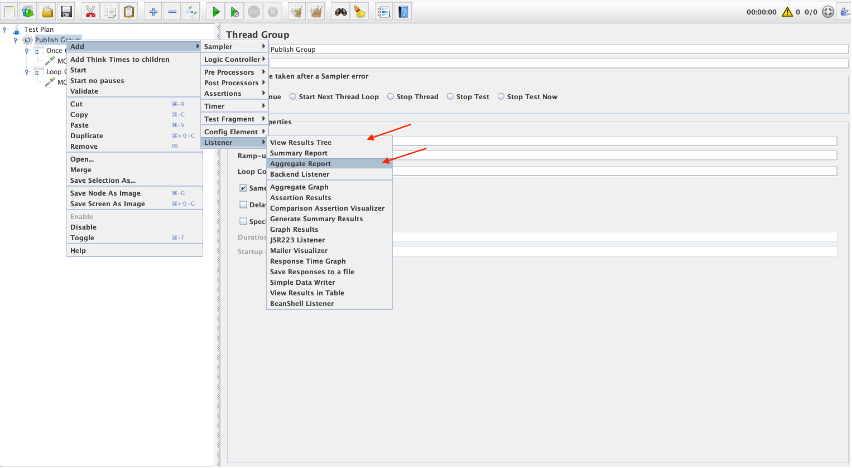

13. 在 Publish Group 中设置并发数为 200

    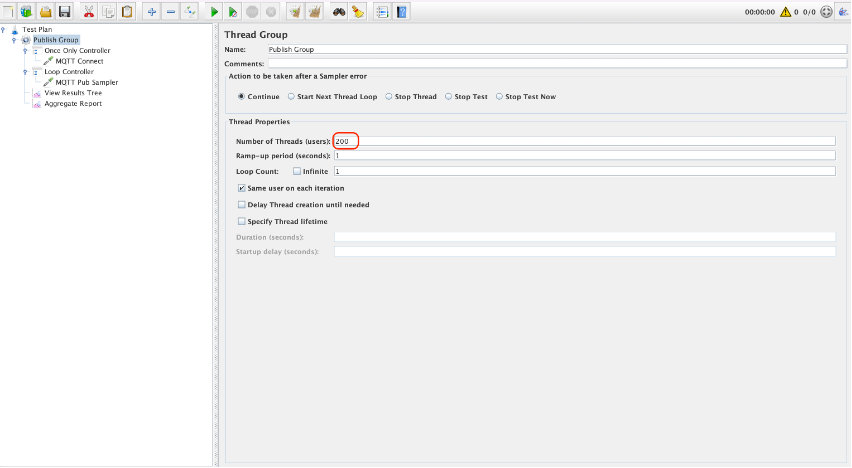

执行测试

1. 首先点击 Subscriber 的 Start 按钮，使之建立连接开始监听

    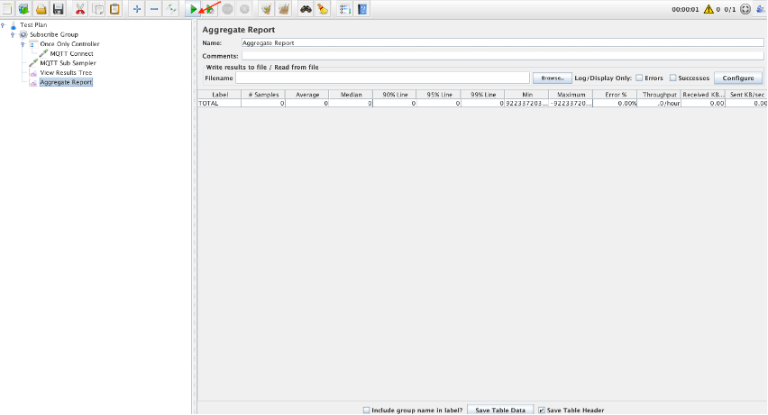

2. 再点击 Publisher 的 Start 按钮，开始发送消息

    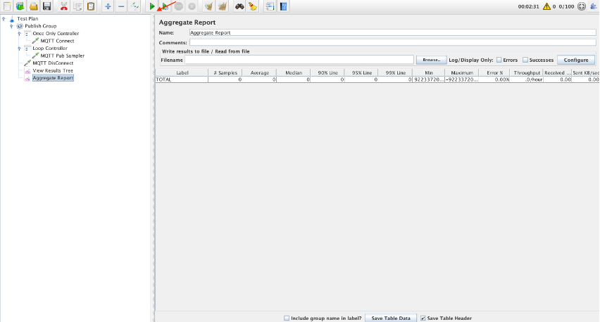

测试结果

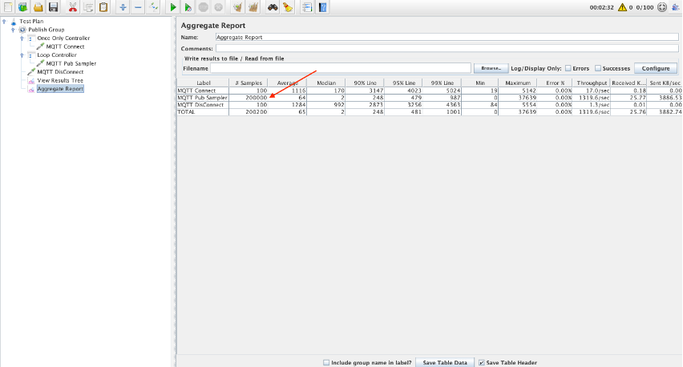

### 2.2 代码压测

#### 2.2.1 paho + async

## 3. 消息共享
