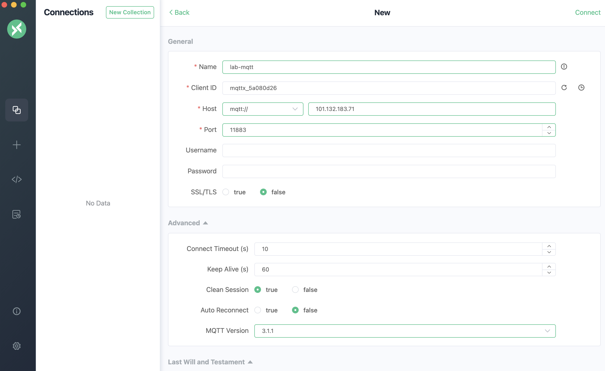
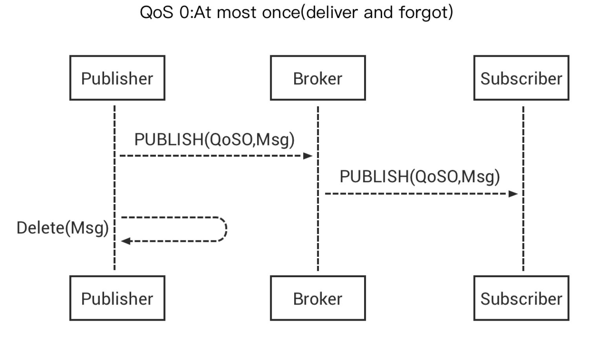
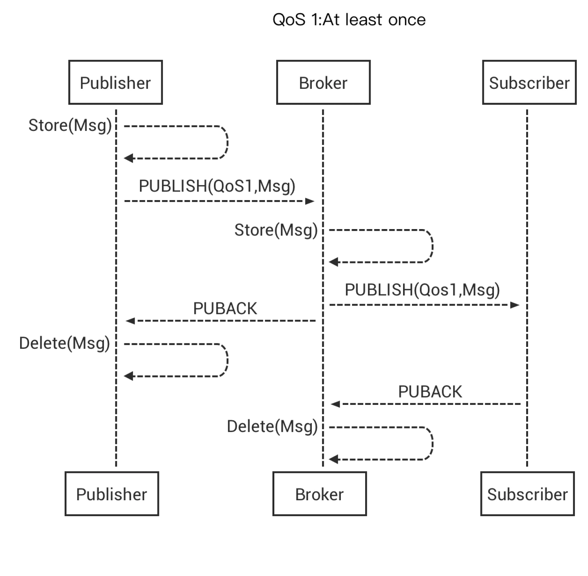
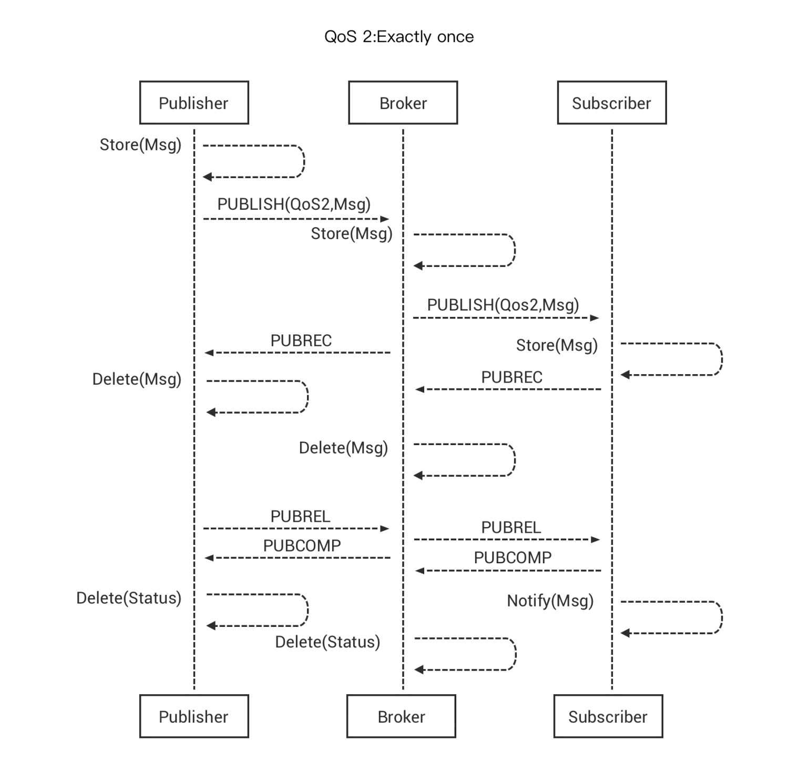
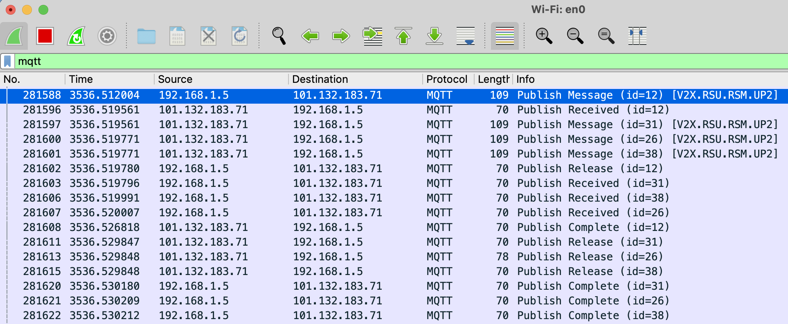
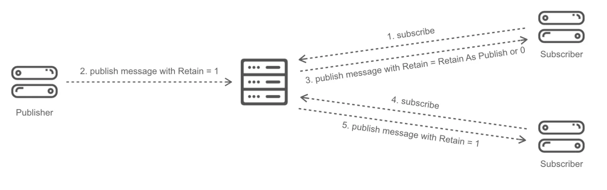

# lab-mqtt

## 1. 基本环境 Quick Start

### 1.1 基础环境

#### 1.1.1 云服务器：

- CentOS 7.9
- 2C/4G/40G
- 50M 带宽

#### 1.1.2 预配置

```console
$ pwd
/Users/wuwenxiang/local/github-mine/demotheworld/ansible

$ cat playbooks/cloudlab-init-with-rdp.yaml
- hosts: cloudlabs
  roles:
    # - init00-mount-disk
    - init01-prepare
    # - init02-rdp
    # - init03-01-kvm
  become: yes

$ diff inventory/lab-c2009.ini inventory/c2009.ini.example 
24c24,25
< lab-mqtt
---
> cloudlab001
> cloudlab002

$ ansible-playbook -i inventory/lab-c2009.ini playbooks/cloudlab-init-with-rdp.yaml
```

#### 1.1.3 安装 Docker 环境

参考：<https://gitee.com/dev-99cloud/training-kubernetes/blob/master/doc/class-01-Kubernetes-Administration.md#16-%E5%AE%9E%E9%AA%8Cdocker-quick-start>

```bash
apt-get update -y || yum update -y
apt-get install docker.io -y || yum install docker -y
systemctl enable docker --now
docker run hello-world
```

### 1.2 MQTT Server 搭建

#### 1.2.1 使用 emqx 搭建

```bash
# 搭建 MQTT Server（可选）
docker stop emqx
docker rm emqx
docker run -d --name emqx -p 1883:1883 -p 8081:8081 -p 8083:8083 -p 8084:8084 -p 8883:8883 -p 18083:18083 emqx/emqx:4.3.11
```

### 1.3 配置 MQTT 客户端

#### 1.3.1 MAC 上的 MQTTX



#### 1.3.2 Python Client

```bash
pip3 install paho-mqtt

python src/mqtt_subscribe.py 101.132.183.71 1883 "V2X.RSU.RSM.UP2"
python src/mqtt_publish.py 101.132.183.71 1883 "V2X.RSU.RSM.UP2"
```

### 1.4 MQTT 配置项

MQTT Spec：<https://mqtt.org/mqtt-specification/>

#### 1.4.1 QoS

按照 MQTT QoS 描述，QoS 2 表示 [Exactly once delivery](http://docs.oasis-open.org/mqtt/mqtt/v3.1.1/os/mqtt-v3.1.1-os.html#_Toc398718037)，QoS 2 需要服务端和客户端双方配合，参考 <https://www.emqx.com/en/blog/introduction-to-mqtt-qos>







| QoS of publish | QoS of subscribe | QoS of received message |
| - | - | - |
| 0 | 0 | 0 |
| 0 | 1 | 0 |
| 0 | 2 | 0 |
| 1 | 0 | 0 |
| 1 | 1 | 1 |
| 1 | 2 | 1 |
| 2 | 0 | 0 |
| 2 | 1 | 1 |
| 2 | 2 | 2 |

测试场景：Wireshark 抓包

一个 Publisher，三个 Subscriber



QoS 2 场景，Broker 只有在收到 PUBREC 才不再发 PUBLISH 消息，因此多 Subscribers 场景下，消息会发送多次（Message ID 不同）。

这里要考虑使用 MQTT 5.0 中的共享订阅，才能通过负载均衡来避免重复消息（也不能保证绝对）。

#### 1.4.2 Retain

Retain 的使用场景，参考 <https://www.emqx.com/en/blog/mqtt5-features-retain-message>



当 retain = True 时，发消息之后再 subscribe 对应 topic 的 client 也能收到，一般用于设备状态汇报。

#### 1.4.3 Clean Session

Clean Session 参考：<http://www.steves-internet-guide.com/mqtt-clean-sessions-example/>

Clean Session = False 时，除非 Client 主动 unsubsribe，否则 Topic 一直存在，离线消息会被保存，直至 client 重新上线接收，不论 QoS 0/1/2 均如此。

## 2. 压测

## 3. 消息共享
